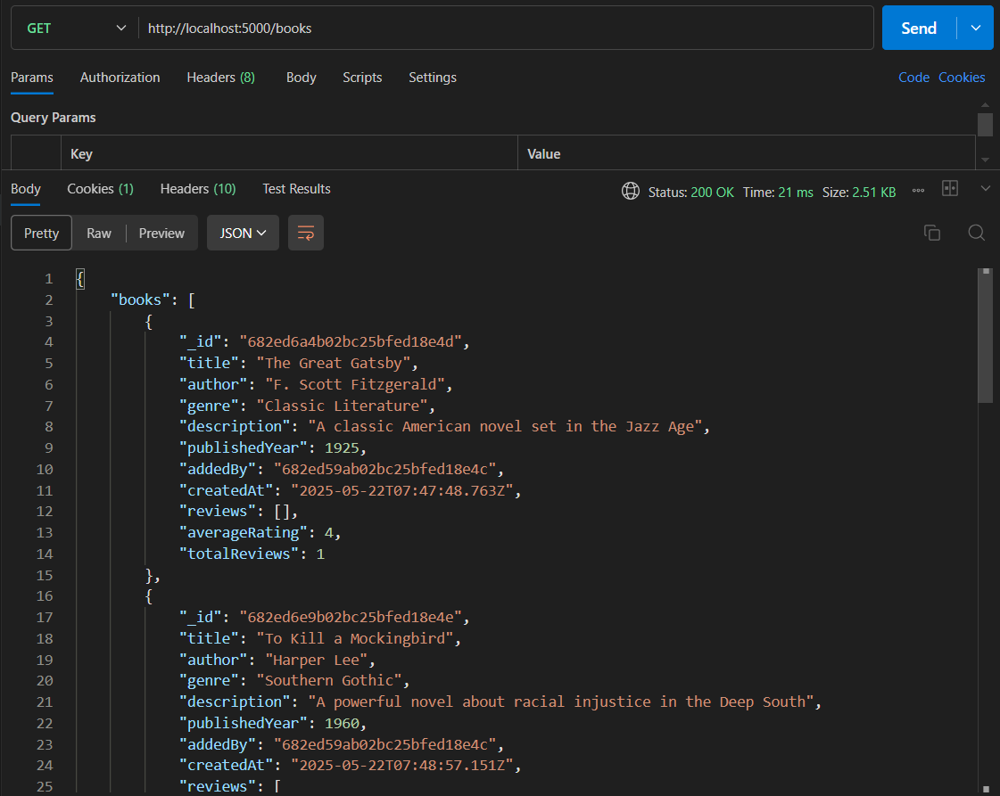
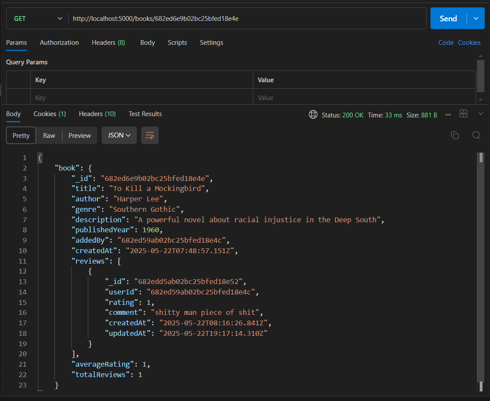
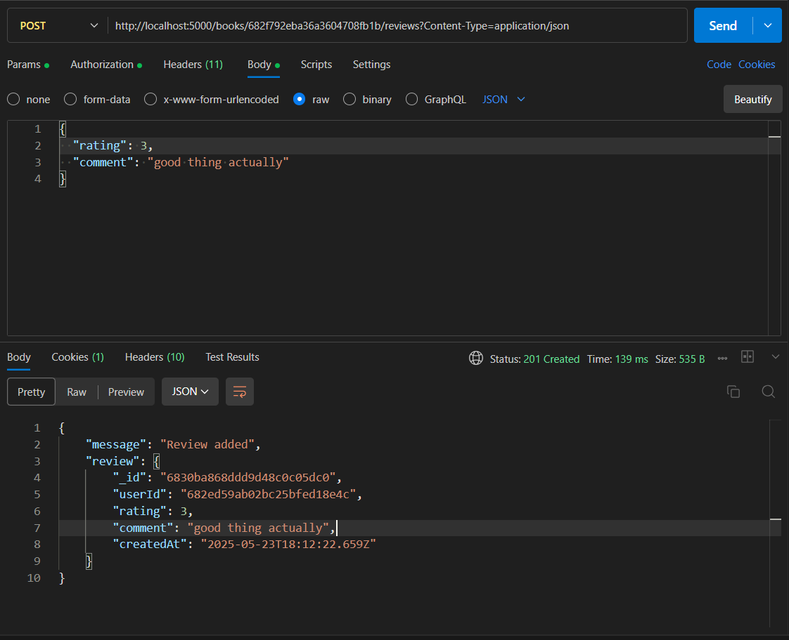
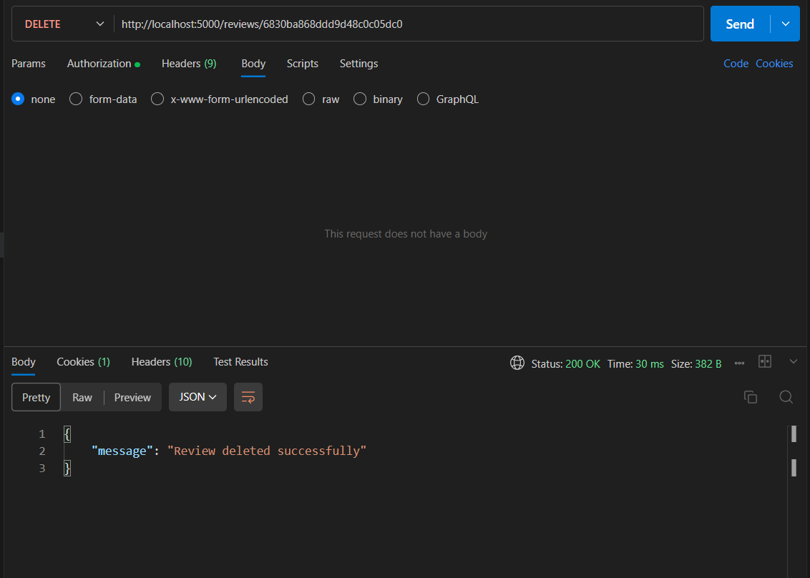
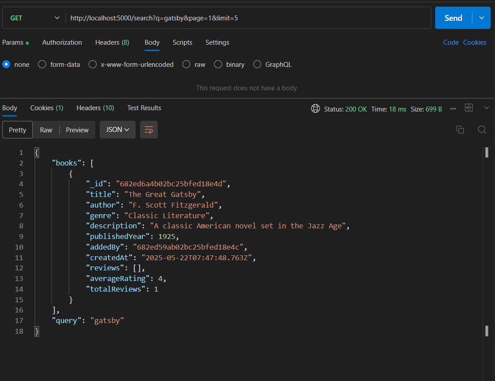
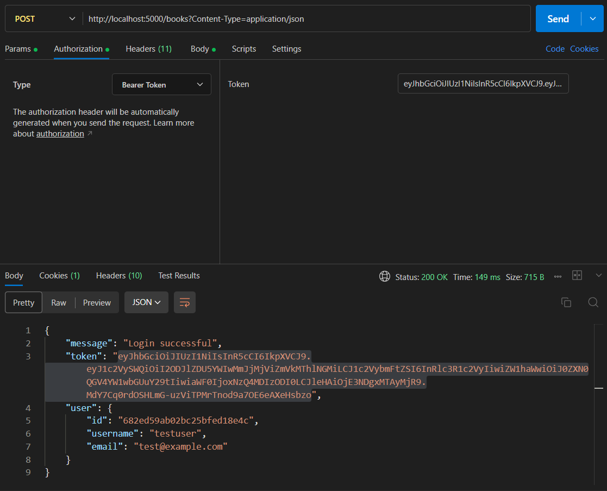
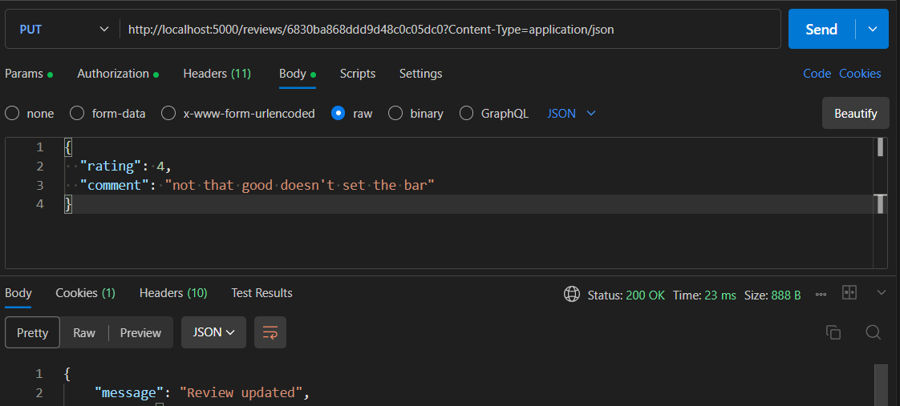

# Book Review API - Postman Testing Guide

## 📸 Postman Testing Screenshots

Below are visual references for key Postman test cases of this API:

| Endpoint | Description | Screenshot |
|----------|-------------|------------|
| `GET /books` | Fetch all books |  |
| `GET /books/:id` | Fetch book by ID |  |
| `POST /books/:id/reviews` | Add a review |  |
| `DELETE /reviews/:id` | Delete your own review |  |
| `GET /search?query=...` | Search books |  |
| `POST /books` | Add a new book |  |
| `PUT /reviews/:id` | Update a review |  |

---

## Base URL
```
http://localhost:3000
```

## 1. Authentication Tests

### 1.1 User Signup
- **Method**: `POST`
- **URL**: `http://localhost:3000/signup`
- **Headers**: 
  ```
  Content-Type: application/json
  ```
- **Body** (raw JSON):
  ```json
  {
    "username": "testuser",
    "email": "test@example.com",
    "password": "password123"
  }
  ```
- **Expected Response**: 201 Created
  ```json
  {
    "message": "User created successfully",
    "token": "eyJhbGciOiJIUzI1NiIsInR5cCI6IkpXVCJ9...",
    "user": {
      "id": "64f1234567890abcdef12345",
      "username": "testuser",
      "email": "test@example.com"
    }
  }
  ```

### 1.2 User Login
- **Method**: `POST`
- **URL**: `http://localhost:3000/login`
- **Headers**: 
  ```
  Content-Type: application/json
  ```
- **Body** (raw JSON):
  ```json
  {
    "email": "test@example.com",
    "password": "password123"
  }
  ```
- **Expected Response**: 200 OK
  ```json
  {
    "message": "Login successful",
    "token": "eyJhbGciOiJIUzI1NiIsInR5cCI6IkpXVCJ9...",
    "user": {
      "id": "64f1234567890abcdef12345",
      "username": "testuser",
      "email": "test@example.com"
    }
  }
  ```

## 2. Book Management Tests

### 2.1 Add a New Book (Authenticated)
- **Method**: `POST`
- **URL**: `http://localhost:3000/books`
- **Headers**: 
  ```
  Content-Type: application/json
  Authorization: Bearer YOUR_JWT_TOKEN_HERE
  ```
- **Body** (raw JSON):
  ```json
  {
    "title": "The Great Gatsby",
    "author": "F. Scott Fitzgerald",
    "genre": "Classic Literature",
    "description": "A classic American novel set in the Jazz Age",
    "publishedYear": 1925
  }
  ```
- **Expected Response**: 201 Created
  ```json
  {
    "message": "Book added successfully",
    "book": {
      "id": "64f1234567890abcdef12346",
      "title": "The Great Gatsby",
      "author": "F. Scott Fitzgerald",
      "genre": "Classic Literature",
      "description": "A classic American novel set in the Jazz Age",
      "publishedYear": 1925,
      "averageRating": 0,
      "totalReviews": 0
    }
  }
  ```

### 2.2 Get All Books (with pagination)
- **Method**: `GET`
- **URL**: `http://localhost:3000/books`
- **Query Parameters** (optional):
  - `page=1`
  - `limit=10`
  - `author=Fitzgerald`
  - `genre=Classic`
- **Headers**: None required
- **Example URLs**:
  - `http://localhost:3000/books`
  - `http://localhost:3000/books?page=1&limit=5`
  - `http://localhost:3000/books?author=Fitzgerald`
  - `http://localhost:3000/books?genre=Classic&page=1&limit=10`

### 2.3 Get Book by ID
- **Method**: `GET`
- **URL**: `http://localhost:3000/books/{book_id}`
- **Example**: `http://localhost:3000/books/64f1234567890abcdef12346`
- **Query Parameters** (optional):
  - `page=1` (for reviews pagination)
  - `limit=5` (for reviews pagination)
- **Headers**: None required

### 2.4 Search Books
- **Method**: `GET`
- **URL**: `http://localhost:3000/search`
- **Query Parameters**:
  - `q=gatsby` (search query)
  - `page=1` (optional)
  - `limit=10` (optional)
- **Example**: `http://localhost:3000/search?q=gatsby&page=1&limit=5`

## 3. Review Management Tests

### 3.1 Add a Review (Authenticated)
- **Method**: `POST`
- **URL**: `http://localhost:3000/books/{book_id}/reviews`
- **Example**: `http://localhost:3000/books/64f1234567890abcdef12346/reviews`
- **Headers**: 
  ```
  Content-Type: application/json
  Authorization: Bearer YOUR_JWT_TOKEN_HERE
  ```
- **Body** (raw JSON):
  ```json
  {
    "rating": 5,
    "comment": "Absolutely brilliant book! A masterpiece of American literature."
  }
  ```
- **Expected Response**: 201 Created
  ```json
  {
    "message": "Review added successfully",
    "review": {
      "id": "64f1234567890abcdef12347",
      "rating": 5,
      "comment": "Absolutely brilliant book! A masterpiece of American literature.",
      "username": "testuser",
      "createdAt": "2024-01-15T10:30:00.000Z"
    }
  }
  ```

### 3.2 Update Your Review (Authenticated)
- **Method**: `PUT`
- **URL**: `http://localhost:3000/reviews/{review_id}`
- **Example**: `http://localhost:3000/reviews/64f1234567890abcdef12347`
- **Headers**: 
  ```
  Content-Type: application/json
  Authorization: Bearer YOUR_JWT_TOKEN_HERE
  ```
- **Body** (raw JSON):
  ```json
  {
    "rating": 4,
    "comment": "Great book, but not my absolute favorite."
  }
  ```

### 3.3 Delete Your Review (Authenticated)
- **Method**: `DELETE`
- **URL**: `http://localhost:3000/reviews/{review_id}`
- **Example**: `http://localhost:3000/reviews/64f1234567890abcdef12347`
- **Headers**: 
  ```
  Authorization: Bearer YOUR_JWT_TOKEN_HERE
  ```

## 4. Testing Workflow

### Step-by-Step Testing Process:

1. **Start the server**:
   ```bash
   node working-server.js
   ```

2. **Test User Signup**:
   - Create a new user using the signup endpoint
   - Copy the returned JWT token

3. **Test User Login**:
   - Login with the same credentials
   - Verify you get a valid token

4. **Test Add Book**:
   - Use the JWT token in Authorization header
   - Add a new book

5. **Test Get All Books**:
   - Verify the book appears in the list
   - Test pagination and filters

6. **Test Add Review**:
   - Use the book ID from step 4
   - Add a review with the JWT token

7. **Test Get Book Details**:
   - Verify the book shows the review and updated rating

8. **Test Search**:
   - Search for the book by title or author

9. **Test Update/Delete Review**:
   - Update your review
   - Delete your review

## 5. Common Error Responses

### 400 Bad Request
```json
{
  "error": "Title, author, and genre are required"
}
```

### 401 Unauthorized
```json
{
  "error": "Access token required"
}
```

### 403 Forbidden
```json
{
  "error": "You can only update your own reviews"
}
```

### 404 Not Found
```json
{
  "error": "Book not found"
}
```

### 409 Conflict
```json
{
  "error": "You have already reviewed this book"
}
```

## 6. Sample Test Data

### Additional Books to Add:
```json
{
  "title": "To Kill a Mockingbird",
  "author": "Harper Lee",
  "genre": "Fiction",
  "description": "A gripping tale of racial injustice and childhood innocence",
  "publishedYear": 1960
}
```

```json
{
  "title": "1984",
  "author": "George Orwell",
  "genre": "Dystopian Fiction",
  "description": "A dystopian social science fiction novel",
  "publishedYear": 1949
}
```
